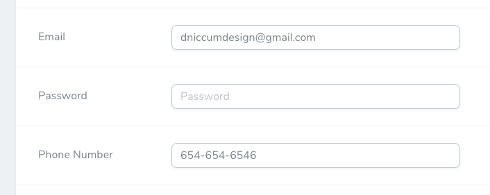

# Laravel Nova Phone Number Field

A Laravel Nova field to format using a dynamic input mask and additional phone number validation.

**NOTE: This field utilizes [Propaganistas / Laravel-Phone package](https://github.com/Propaganistas/Laravel-Phone) for validation.**



## Installation

To install this tool, use the installation code below:

```
composer require dniccum/phone-number
```

## Code

To use the field, add the following code to your Nova resource. As this is a field, all of the default field properties can be applied.

```php
use Dniccum\PhoneNumber\PhoneNumber;

PhoneNumber::make('Phone Number')
```

### Options

To support multiple types and formats of phone numbers, this field has multiple methods for input masking and validation that are available.

#### Defaults

| Method/Options     | Default                       |
|--------------------|-------------------------------|
| format             | **string:** '(###) ###-####'  |
| placeholder        | **string:** '[Name of Field]' |
| useMaskPlaceholder | **boolean:** false            |
| country            | **string:** 'US'              |
| countries          | **string[]:** ['US']          |
| disableValidation  | **boolean:** false            |
| linkOnIndex        | **boolean:** false            |
| linkOnDetail       | **boolean:** false            |

#### format

```php
PhoneNumber::make('Phone Number')
    ->format('###-###-####')
```

**Type:** string

**Default:** (###) ###-####

This is the value that the javascript controlling the input mask will use define it's values; and depending the field's configuration the placeholder text. To indicate numbers, use the hash (#) symbol.

**Note:** Other types of content can be included within this input like an phone extension:

```php
PhoneNumber::make('Phone Number')
    ->format('###-###-#### ext ####')
```

However the built-in phone number validation will **FAIL** as this is technically an invalid phone number. To prevent the validation from failing, turn off the phone number validation like so:

```php
PhoneNumber::make('Phone Number')
    ->format('###-###-####')
    ->disableValidation()
```

#### placeholder

```php
PhoneNumber::make('Phone Number')
    ->placeholder('Personal Home Number')
```

**Type:** string

**Default:** [Name of the Field]

If you would like to override the default placeholder supplied by Nova, which is the name of field, user a simple string.

**Note:** If you are telling the input to override the placeholder by using the input's mask with the `useMaskPlaceholder` method, this will not work.

#### useMaskPlaceholder

```php
PhoneNumber::make('Phone Number')
    ->useMaskPlaceholder()
```

**Type:** boolean

**Default:** false

This will tell the field to replace the input's defined placeholder with the input mask from the `->format()` method. 

#### country

```php
PhoneNumber::make('Phone Number')
    ->country('CA')
```

**Type:** string

**Default:** US

This tells the field what type of phone number validation to use. To define a type of validation, define a [ISO 3166-1 alpha-2 compliant](https://en.wikipedia.org/wiki/ISO_3166-1_alpha-2#Officially_assigned_code_elements) country code.

You can only define one country here. If you would like to define more than one, please see the `->countries()` method.

**NOTE: This field utilizes [Propaganistas / Laravel-Phone package](https://github.com/Propaganistas/Laravel-Phone) for validation.**

#### countries

```php
PhoneNumber::make('Phone Number')
    ->countries(['US', 'CA'])
```

**Type:** string[]

**Default:** US

If you would like to define more than one country to validate against, define string-based array of [ISO 3166-1 alpha-2 compliant](https://en.wikipedia.org/wiki/ISO_3166-1_alpha-2#Officially_assigned_code_elements) country codes.

**NOTE: This field utilizes [Propaganistas / Laravel-Phone package](https://github.com/Propaganistas/Laravel-Phone) for validation.**

#### linkOnIndex

```php
PhoneNumber::make('Phone Number')
    ->linkOnIndex()
```

**Type:** boolean

**Default:** false

Render's the phone number as a clickable link on the index view.

#### linkOnDetail

```php
PhoneNumber::make('Phone Number')
    ->linkOnDetail()
```

**Type:** boolean

**Default:** false

Render's the phone number as a clickable link on the detail view.

## Credits

* [Doug Niccum](https://github.com/dniccum)

## License

The MIT License (MIT). Please see [License File](./LICENSE.md) for more information.